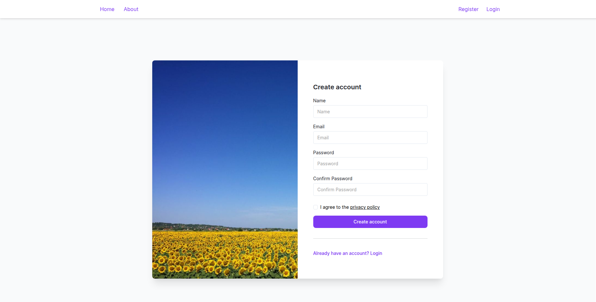
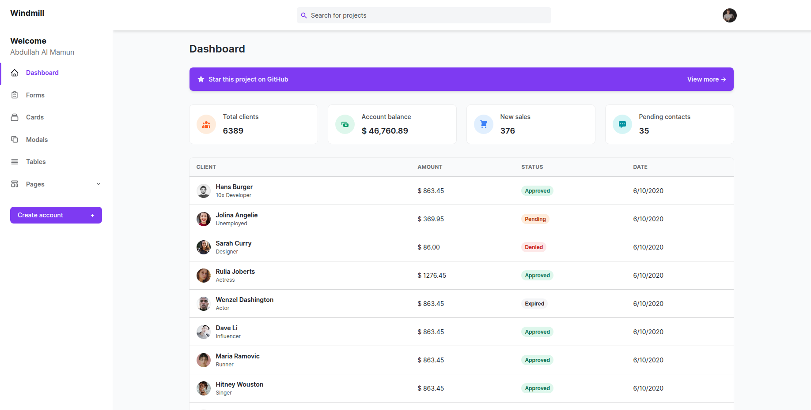

<p><a href="https://laravel.com" target="_blank"></a></p>

## Laravel Vue Inertia Tailwindcss Project

I've started this project to learn and use the basic of inertia and tailwindcss without scaffolding with any starter kits. I will share my experience later. 

## Technologies

- Backend: Laravel 12.
- Frontend: Vue.js, Inertia.js.
- UI Framework: TailwindCSS.
- Database: MySQL.
- Authentication: NO Starter Kit

## Prerequisites

- PHP 8.2+
- Composer
- Node.js & npm
- MySQL

## Screenshots
login

Dashboard


## Github
```bash
If you download this project from Github

composer install
npm install
connect database to .env
connect smtp to .env
php artisan key:generate
php artisan storage:link
php artisan migrate --seed
npm run dev
php artisan serve
```
